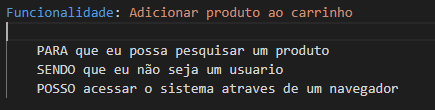
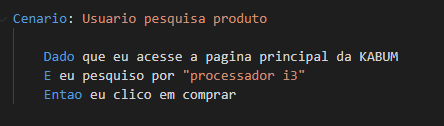

# Smarkio Teste Técnico

## Linguagens Utilizadas
### Capybara - Software de automação de teste baseado na Web que simula cenários para histórias de usuários e automatiza o teste de aplicativos da Web.
### Cucumber - Software que suporta o desenvolvimento orientado pelo comportamento. O ponto central da abordagem do BDD.
### Ruby -  Linguagem de programação.
### Selenium - Estrutura portátil para testar aplicativos da web.

## Ferramentas utilizadas
### Sistema Operacional utilizado - Windows 10 Education.
### Visual Studio Code - IDE para criação dos códigos.
### Chromedriver - clique no [site](https://chromedriver.chromium.org/downloads) para o download da versão. Mova o arquivo .EXE para C:\Windows - obs: certifique-se de verificar a versão do Google Chrome.
### RainsInstaller - clique no [site](http://railsinstaller.org/pt-BR) para o download do Ruby.

## Guia de instalação

1° - Baixe o projeto, descompacte a pasta "Smarkio" para o diretorio C:\

2° - no "prompt de comando" (cmd), insira C:\Smarkio

3° - insira no cmd "C:\Smarkio>gem install bundler" 

4° - insira no cmd "C:\Smarkio>bundler install" 

5° - para garantir que as instalações foram realizadas insire no cmd "C:\Smarkio>ruby --version", "C:\Smarkio>chromedriver --version", "C:\Smarkio>cucumber --version", "C:\Smarkio>cucumber --version"

6° - para roda a aplicação no cmd insira "C:\Smarkio>Cucumber" 

## Teste de automação de fluxo com e-commerce
Neste Readme irei apresentar como estruturei meu BDD.

### Historia do usuario
<strong>PARA</strong> que eu possa pesquisar um produto  
<strong>SENDO</strong> que eu não seja um usuário  
<strong>POSSO</strong> acessar o sistema através de um navegador

### Funcionalidade 

### Cenário

